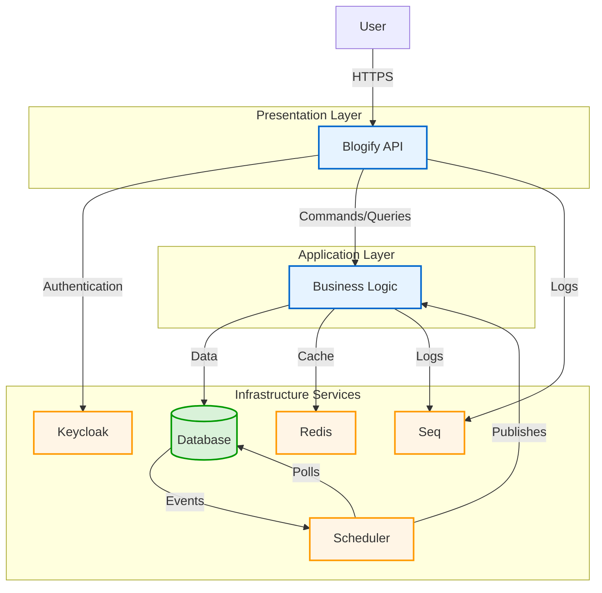

# Blogify API

A modern, robust, and scalable backend API for a blogging platform. Built with **.NET 9**, following **Clean Architecture** principles, **Domain-Driven Design (DDD)**, and the **CQRS** pattern.

---

## 🚀 Table of Contents

- [Features](#features)
- [Technology Stack](#technology-stack)
- [Architecture Overview](#architecture-overview)

---

## ✨ Features

- **User Management:** Secure user registration and login via Keycloak
- **Content Management:** Full CRUD for Posts, Categories, and Tags
- **Interactive Content:** Comment support on posts
- **API Versioning:** Endpoints versioned (e.g., `/api/v1/...`)
- **Health Checks:** Database, cache, and authentication provider monitoring
- **Asynchronous Processing:** Outbox Pattern with Quartz.NET for reliable background domain event processing
- **Robust Architecture:** Layered design for maintainability, scalability, and testability

---

## 🛠️ Technology Stack

| Area               | Technology / Library                          |
|--------------------|-----------------------------------------------|
| Backend Framework  | .NET 9 & ASP.NET Core                         |
| Architecture       | Clean Architecture, DDD, CQRS                 |
| Database           | PostgreSQL                                    |
| ORM / Data Access  | Entity Framework Core 9, Dapper               |
| Authentication     | Keycloak (OAuth 2.0 / OIDC)                   |
| Caching            | Redis (via IDistributedCache)                 |
| Testing            | xUnit, NSubstitute, Shouldly, Testcontainers  |
| Logging            | Serilog, Seq                                  |
| API & Docs         | REST, OpenAPI (Swagger), Asp.Versioning.Mvc   |
| Validation         | FluentValidation                              |
| Scheduling         | Quartz.NET                                    |

---

## 🏛️ Architecture Overview

Blogify implements **Clean Architecture** to ensure loose coupling, testability, and scalability. The major layers are:

- **Domain:** Core business models and rules (no dependencies)
- **Application:** Business logic using CQRS (only depends on Domain)
- **Infrastructure:** Database, authentication, caching, and other service implementations
- **API (Presentation):** Exposes functionality via RESTful endpoints

